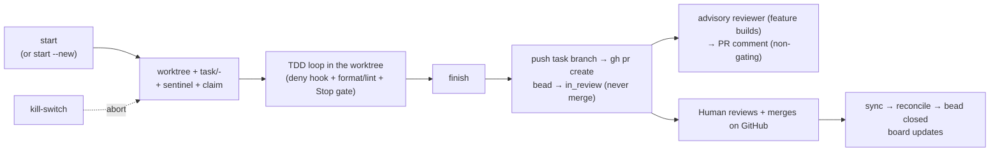

# Lifecycle

The real path a unit of work takes, end to end — from a fuzzy objective to a merged, closed bead.
There are two pipelines: **intake** (objective → ratified spec → beads) and **build** (bead → PR →
merge → closed). Each stage below is tagged by who acts:

- **AUTOMATED** — trusted harness code; deterministic, no model judgment.
- **AGENT** — the LLM does the work, bounded by mechanical floors. Enforcement is
  **Claude-Code-first**: under Claude Code the real-time hook floor applies; another agent (e.g. Codex)
  can drive the same loop but under a weaker floor — the git hooks and fail-closed scripts only.
- **HUMAN** — a person must act; where that requirement is _mechanical_ vs. _convention_ is called
  out, because it matters for the trust model.

The unit of work is a **bead** (`open → in_progress → in_review → closed`; `ready` is a _derived_
query — a bead with no open blockers — not a stored status).

---

## Pipeline 1 — Intake (`harness/intake.sh`)

Turns an objective into a human-ratified, decomposed spec and mints the beads the build loop claims.
Two human sign-offs bracket it; everything between is the session's.

| Stage                          | Command / where                                                                         | Actor                                  | Notes                                                                                                                                                                                                           |
| ------------------------------ | --------------------------------------------------------------------------------------- | -------------------------------------- | --------------------------------------------------------------------------------------------------------------------------------------------------------------------------------------------------------------- |
| Scaffold                       | `intake.sh start "<objective>" --target <repo[,repo]> [--mode interactive\|autonomous]` | AUTOMATED                              | Creates `specs/NNN-<slug>/spec.md` from the template, arms the intake sentinel. No TTY gate — an agent can run it.                                                                                              |
| Clarify loop                   | clarify skill, bounded by `pre-tool-use-clarify-gate.sh` + `stop-gate-intake.sh`        | AGENT in a mechanical bracket          | Budgeted question rounds; every unresolved ambiguity is _routed_ to an `[ASSUMED]` entry, never dropped. Autonomous mode never asks a human.                                                                    |
| Grant more rounds              | `intake.sh clarify [--axis <id>]`                                                       | HUMAN by convention                    | **Not TTY-gated** — an agent's Bash can run it. The "human grant" is convention, not mechanism (unlike `ratify`). Re-opens Gate A and invalidates the ratify token if already ratified.                         |
| Spec review                    | `intake.sh spec-review` (captures a `spec-reviewer` verdict)                            | AUTOMATED capture of an AGENT reviewer | Read-only adversarial review vs. the coverage taxonomy; the verdict is advisory in content but its open-finding count is the mechanical consensus input at Gate A.                                              |
| **Gate A — ratify**            | `intake.sh ratify`                                                                      | **HUMAN (mechanical)**                 | TTY-gated (`[ -t 0 ] && [ -t 1 ]`); the agent's non-TTY Bash cannot pass it. Binds a non-forgeable token to `sha256(understanding.md)` + the FR-line hash.                                                      |
| Decompose                      | decompose skill (writes the Task Breakdown block)                                       | AGENT                                  | Produces tasks with binary DoD and measurable, tech-agnostic success criteria, plus the three machine fields (`scope`, `dod_tests`, `sc_evidence`).                                                             |
| **Gate A′ — ratify-breakdown** | `intake.sh ratify-breakdown`                                                            | **HUMAN (mechanical)**                 | TTY-gated like Gate A. A second token binds `sha256(the Task Breakdown)`, so `convert` mints only a breakdown a human approved.                                                                                 |
| **Gate B — analyze**           | `intake.sh analyze`                                                                     | AUTOMATED (no LLM)                     | Nine Task-Breakdown invariants + bidirectional FR↔task traceability, all pure `awk`/`grep`/`jq`.                                                                                                                |
| Convert / mint                 | `intake.sh convert`                                                                     | AUTOMATED, gated on both human tokens  | Re-hashes both tokens (anti-TOCTOU), checks freshness, runs the witness preflight, then mints beads in dependency order via `bd create` and writes `crosswalk.json` (`T0NN → bead-id`). Wipes all intake state. |

Two commands the human can run anytime: `intake.sh clarify` (grant a round, even past budget) and
`intake.sh abort` (clear intake state; the spec under `specs/` is left in place). `abort`, like
`clarify`, is not TTY-gated — but it only destroys state, it cannot forge it.

**Why the ratify gates are the real intake guarantee:** the deny hook has a string matcher that
denies an agent typing `intake.sh ratify`, but that is defense-in-depth. The actual guarantee is the
TTY check inside the command plus the fact that the token lives under `.harness/` (which the agent
cannot write). A residual remains — an agent that allocates a PTY _and_ routes through a wrapper file
dodging the string matcher — and it is conceded to OS-level confinement (see
[`limitations.md`](limitations.md)).

The minted beads then enter the build loop: `run-task.sh ready` lists them.

---

## Pipeline 2 — Build (`harness/run-task.sh`)

### Stage 1 — Claim (`start`) — AUTOMATED, fail-closed

`./harness/run-task.sh start <bead-id>` or `start --new "<desc>"`.

1. On the unattended path, an out-of-band stale-container sweep runs first (gated to
   `FORGE_UNATTENDED`).
2. `require_root` warns if `$PWD` ≠ repo root (hard refusal under `FORGE_REQUIRE_ROOT=1`); refuse if a
   task is already active; `bd` version/status preflight.
3. **Confinement pre-check:** a non-attended start (`FORGE_UNATTENDED=1` or no TTY) is **refused
   unless `FORGE_SANDBOX=1`**, before any side effect. An attended **self-build** is exempt — it runs
   host-side (the documented maintenance exception); an attended **target** build is containerized by
   default (see stage 7).
4. `--new` mints a one-off bead (`bd create`) directly — the only _ad-hoc_ create path in the build
   loop, and a deliberate exception: in the normal flow **beads are architect-generated from a ratified
   spec** (intake → `convert`), and a `--new` bead carries no acceptance contract (see
   [`limitations.md`](limitations.md) and the acceptance gate). Otherwise the bead must exist, be
   in `bd ready`, and be unassigned, or fail closed ("not claimable … no silent mint, no re-claim").
   The bead ID is canonicalized to its full form so a prefix start cannot desync the branch/record
   from the reconcile key.
5. Branch `task/<id>-<slug>`, worktree at `.claude/worktrees/<slug>`, branched from HEAD (self) or the
   feature branch (feature builds) so the worktree carries the live `.claude/` hooks.
6. Self-vs-target classification (see below); write the sentinel `.harness/active-task.json`; then
   `bd update --claim` (after the sentinel, so kill-switch can release on a later failure).
7. Container bring-up — `if FORGE_SANDBOX=1` **or** (target build **and** `FORGE_TARGET_CONTAINER≠0`,
   default on; the legacy `FORGE_TARGET_REQUIRE_CONTAINER=1` is honored as an alias) — networked by
   default (`FORGE_SANDBOX_NETWORK`, `none` to restrict), with an EROFS liveness probe and a
   failure-path teardown trap.

### Stage 2 — TDD loop — AGENT, bounded

The agent writes a failing test, then code, until green, working under the printed work root
(`sandbox/` for self builds; the target worktree for target builds). Bounding it in real time: the
deny hook (writes confined to the work root; destructive shapes denied), the PostToolUse format+lint
on sandbox writes, and the Stop tests-gate.

**The Stop tests-gate is mode-split** — a distinction that is easy to over-claim:

- **Unattended (`FORGE_UNATTENDED=1`):** the gate _never_ releases on red. A wedged session is ended
  by the external wall-clock reaper, not by the gate.
- **Attended:** the gate blocks on red but **releases after a cap** (`FORGE_STOP_BLOCK_CAP`, default 8)
  with a "human intervention needed" message. So "you cannot declare done while red" is literally true
  only unattended; attended, it is a bounded nag with a human in the loop.

### Stage 3 — Finish (`finish`) — AUTOMATED chain

`./harness/run-task.sh finish` runs a fixed sequence; any failure stops it (no PR, no merge):

1. **Witness gate** — prove the enforcement floor is loaded and unchanged in this session (hard under
   unattended; conditional attended).
2. **Tests green** — run `TEST_CMD`; red dies. (For a feature build where a sibling already merged,
   a red gate is recorded as a _partial_ and the bead stays claimed, rather than a hard die.)
3. **Acceptance gate `--mode staged`** (`accept-gate.sh`, via a hardcoded `/usr/bin/bash`) — diff ⊆
   scope, DoD tests pass, success-criteria evidence present, integrity sha. No LLM.
4. Self builds: export the `bd` ledger snapshot into the worktree so it reaches `main` only through
   the merged PR. Target builds skip this (the PR must be pristine).
5. **Acceptance gate `--mode rescope`** immediately pre-commit (closes the gate→commit TOCTOU).
6. Target builds: strip any Forge artifacts and assert target purity — a remaining artifact dies.
7. Commit via git plumbing with a deterministic identity; push the task branch to the literal
   captured URL (never force).
8. `gh pr create --base <base>` (feature builds discover-or-create one shared feature PR); set the
   bead → `in_review` and write `.harness/pr/<bead>.json`.
9. Feature builds only: fire the advisory reviewer once, fire-and-forget.
10. Tear the container down (if any), remove the sentinel. **No merge anywhere.**

### Stage 4 — Review — AUTOMATED / AGENT, advisory only

`./harness/review-task.sh <pr>` (auto-fired once per completed feature, or run by hand). The harness
fetches the diff and runs a read-only reviewer in a fresh context (the reviewer gets only
`Read`/`Grep`/`Glob`; the harness talks to GitHub). It writes `.harness/review/<pr>.json`, optionally
adjudicates each finding CONFIRMED/REBUTTED into `.harness/disposition/<pr>.json`, and posts advisory
PR comments. **It never gates the merge** — the deterministic test suite is what must pass, and the
human decides the merge; the reviewer's findings are advisory input, not a gate. A backend that
produces no output posts an honest "review did not run" notice rather than a clean result.

### Stage 5 — Merge — HUMAN

The human reviews the tests and the advisory findings and merges on GitHub. **The Forge never
merges.** The agent's Bash `gh pr merge` is now denied by the deny hook (a bounded client-side
capability boundary — defense-in-depth, not server-side branch protection; a human in a non-agent shell /
the GitHub UI is still trusted); for the reviewer role merge-incapability is mechanical (its tool ceiling
has no way to merge). The merge is the release decision and the ultimate backstop for everything the deny hook
concedes.

### Stage 6 — Reconcile / close — AUTOMATED

`./harness/run-task.sh sync` runs `forge_reconcile_run` (blocking). For each `in_review` bead with a
harness-written PR record, it asks GitHub once whether the PR merged, and closes the bead **only** if
`state == MERGED` and the **id-bound head-ref check** passes:

- **ARM 1** — head ref is `task/<bead>-*` → close (bound to the gh-vouched head ref, never the
  agent-writable record field).
- **ARM 2** — any other `task/*` head ref → **skip** (blocks branch-field forgery / sibling
  re-point — the security-critical arm).
- **ARM 3** — a non-`task/` ref (e.g. `feat/…`) → close on record-branch match (this arm still trusts
  the agent-writable record branch; a documented best-effort residual).

On close it runs `bd close --reason "merged: repo#pr"` and consumes the PR record. The same reconcile
also runs _quietly, best-effort_ after `status` and `ready` — so `sync` is the only _blocking_ close
path, not the only one. **Never `bd close` by hand** (it is denied for the agent; humans go through
`sync`).

### Failure path — Abort (`kill-switch.sh`) — HUMAN command (by convention)

Like `clarify`/`abort`, it is **not TTY-gated** — an agent's Bash can run it (`run-task.sh` even
prints it as the abort instruction) — but it only releases/destroys state, never forges anything.
Removes the worktree/branch/sentinel, releases the bead to `open`, tears the container down, and
deletes the PR record so a re-claim can't inherit a merged-PR record. It does **not** reap leftover
worktrees of already-merged tasks; the container reaper (`reaper.sh`) sweeps _containers_ only. See
[`operating.md`](operating.md#retention-and-cleanup) for the accumulation realities.

---

## Self builds vs. target builds vs. feature builds

The Forge operates on three kinds of work; the classification happens at `start` from the bead's
`metadata.target_repo`.

|                    | Self build                                                            | Target build                                                                                                                  | Feature build                                                                                    |
| ------------------ | --------------------------------------------------------------------- | ----------------------------------------------------------------------------------------------------------------------------- | ------------------------------------------------------------------------------------------------ |
| **What**           | The Forge builds itself.                                              | The Forge builds into an external repo.                                                                                       | A group of beads sharing a `source_spec`, assembled into one PR.                                 |
| **Trigger**        | No `target_repo`, or one resolving to the Forge's own name/git store. | An external `target_repo`, resolved through the gitignored `harness/repos.config` name→abs-path map (a _distinct_ git store). | A bead carries `source_spec`; bases on `feat/<spec-slug>`.                                       |
| **Worktree**       | Of the Forge; confined to `sandbox/`.                                 | Of the _target_ repo; confined to the resolved `work_root`.                                                                   | As self or target, based on the feature branch.                                                  |
| **PR**             | Carries the `bd` ledger snapshot.                                     | Pristine — Forge artifacts stripped and asserted absent (H3).                                                                 | One shared feature PR; every sibling bead's record points at it so they close together on merge. |
| **Ledger / floor** | —                                                                     | Stay Forge-side throughout (`bd` runs `-C <forge root>`).                                                                     | —                                                                                                |

Target builds are the Forge's primary purpose in practice — building into external repos while the
ledger and the enforcement floor stay Forge-side. To run one: give the bead a `metadata.target_repo`,
add that name → absolute clone path to `harness/repos.config` (copy `.example`), and `start` the
bead. See
[`operating.md`](operating.md#target-builds) for the full setup and the environment controls.
